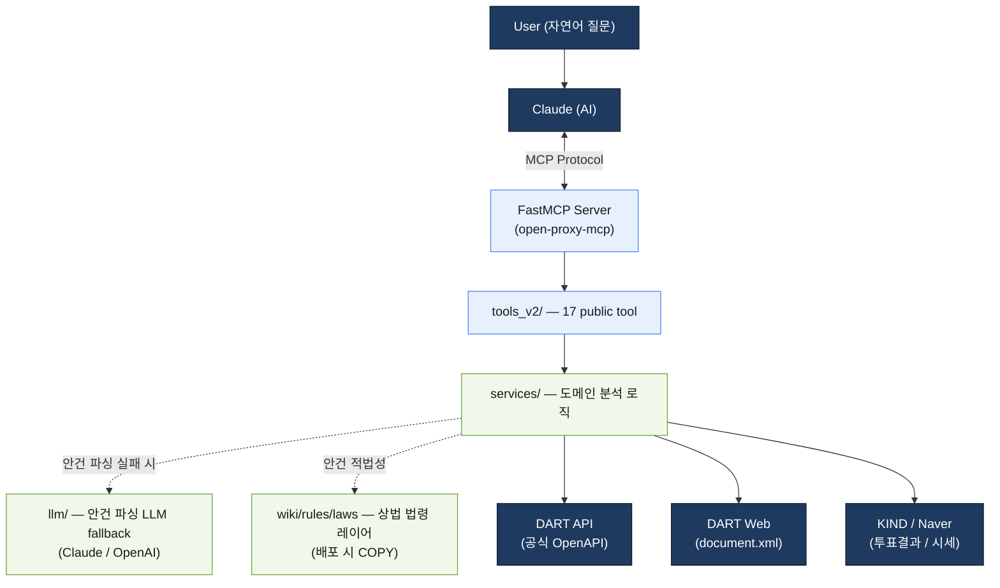
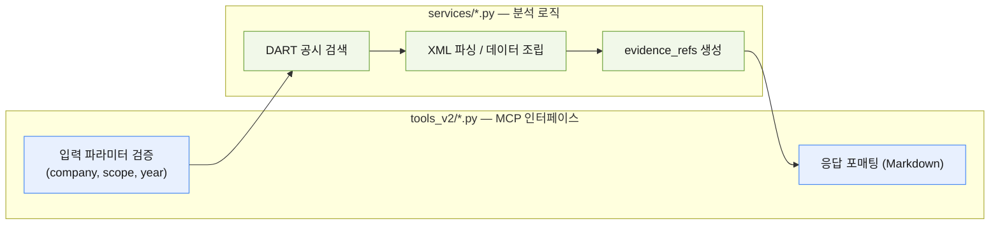
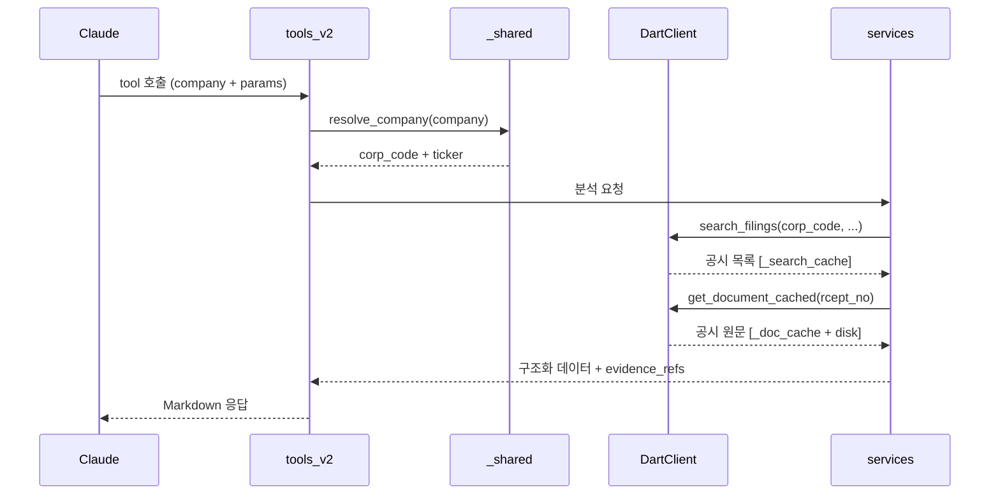

# Architecture (v2)

> v1 아키텍처는 `open-proxy-mcp-v1.3.0` 브랜치 참조.
> tool별 공시 매핑·기능·사용케이스 도식은 [tool_disclosure_map](../wiki/tools/tool_disclosure_map.md) (로컬 wiki).

## System Overview



- **Transport**: streamable-http (Fly.io 프로덕션) / stdio · sse 도 지원
- **API 키**: URL 쿼리 `?opendart=키` → ContextVar → DartClient가 요청별로 읽음
- **배포**: Fly.io (nrt), python:3.12-slim, auto-suspend, 1 vCPU / 1GB

---

## Tool Structure (17개)

v2는 Tier 구조 대신 **진입점 + Data Tools + Action Tool + Evidence** 로 단순화. 관심사(주총·주주환원·지배구조/경영권·펀더멘탈)별로 묶임.

```mermaid
flowchart TB
    classDef entry fill:#fff3e0,color:#1a1a1a,stroke:#fb8c00,stroke-width:2px;
    classDef tool fill:#e8f0fe,color:#1a1a1a,stroke:#4285f4;
    classDef act fill:#fce4ec,color:#1a1a1a,stroke:#e91e63;
    classDef grp fill:#f1f8e9,color:#1a1a1a,stroke:#689f38;

    CMP(["company<br/>진입점 — 기업 식별 + 최근 공시 인덱스"]):::entry

    CMP --> G1["주총 / 의결권"]:::grp
    CMP --> G2["주주환원"]:::grp
    CMP --> G3["지배구조 / 경영권"]:::grp
    CMP --> G4["펀더멘탈 / 사업"]:::grp

    G1 --> shareholder_meeting_notice:::tool
    G1 --> shareholder_meeting_results:::tool
    G1 --> proxy_advise_before_meeting:::act

    G2 --> dividend:::tool
    G2 --> treasury_share:::tool
    G2 --> value_up:::tool

    G3 --> ownership_structure:::tool
    G3 --> proxy_contest:::tool
    G3 --> corp_gov_report:::tool
    G3 --> dilutive_issuance:::tool
    G3 --> corporate_restructuring:::tool
    G3 --> corporate_deals:::tool

    G4 --> financial_metrics:::tool
    G4 --> order_contracts:::tool
    G4 --> risk_events:::tool

    EVD(["evidence<br/>모든 tool의 출처 rcept_no → 뷰어 URL"]):::act
```



- **Data Tools (13)**: shareholder_meeting_notice / shareholder_meeting_results / dividend / treasury_share / value_up / ownership_structure / proxy_contest / corp_gov_report / dilutive_issuance / corporate_restructuring / corporate_deals / financial_metrics / order_contracts / risk_events
- **Action Tool (1)**: proxy_advise_before_meeting (주총 전 의결권 권고 — 안건·후보·재무·법령 종합)
- **Entry / Evidence (2)**: company, evidence

### v1 vs v2 비교

| | v1 | v2 |
|--|----|----|
| Tool 수 | 36개 | 17개 |
| 구조 | 5-Tier (Entity → Context → Search → Orchestrate → Detail) | 진입점 + Data + Action + Evidence |
| 진입점 | `corp_identifier` → `tool_guide` → `agm_search` | `company` 하나로 시작 |
| 파싱 레이어 | tool 내부에서 직접 파싱 | `services/` 레이어로 분리 |
| 안건 파싱 실패 | 누락 | `llm/` LLM fallback |
| PDF 파싱 | 기본 경로 포함 | 제외 (XML/Viewer 우선) |
| 캐시 | XML + PDF 디스크 캐시 | XML 메모리+디스크 캐시만 |

---

## 코드 구조

```
open_proxy_mcp/                 # 패키지 루트
  server.py                     # FastMCP 진입점 (OPEN_PROXY_TOOLSET 분기)
  __main__.py                   # CLI 엔트리 (transport / toolset args)
  dart/
    client.py                   # DartClient — API + 크롤링 + rate limiter + cache
    nps_client.py               # 국민연금(NPS) 보조 클라이언트
  llm/
    client.py                   # 안건 파싱 LLM fallback (Claude 기본 / OpenAI)
  tools_v2/                     # MCP tool 정의 (입력 검증 + 응답 포매팅) — 17개
    __init__.py                 # register_all_tools_v2() — 모듈 자동 등록
    _shared.py                  # 공유 유틸 (resolve_company 등)
    _shareholder_meeting_render.py
    company.py / evidence.py
    shareholder_meeting_notice.py / shareholder_meeting_results.py
    proxy_advise_before_meeting.py / proxy_contest.py
    dividend.py / treasury_share.py / value_up.py
    ownership_structure.py / corp_gov_report.py
    dilutive_issuance.py / corporate_restructuring.py / corporate_deals.py
    financial_metrics.py / order_contracts.py / risk_events.py
  services/                     # 도메인 분석 로직 (tool과 분리)
    shareholder_meeting.py      # 소집공고 + 결과 파싱·분석
    ownership_structure.py      # 지분 구조 분석 (+ holder_table.py)
    dividend_v2.py / treasury_share.py / value_up_v2.py
    proxy_contest.py / proxy_advise.py
    director_performance.py / director_evaluation.py  # 이사 평가
    corp_gov_report.py / financial_metrics.py
    dilutive_issuance.py / corporate_restructuring.py / corporate_deals.py
    order_contracts.py / risk_events.py
    company.py / evidence.py
    filing_search.py            # 공시 검색 공통 로직
    contracts.py                # 데이터 계약 (타입 정의)
    date_utils.py               # 날짜 유틸
  tools/                        # v1 tool (OPEN_PROXY_TOOLSET=v1 시 사용)
  data/                         # OPM 정적 데이터 (운용사 정책+행사내역+Guideline)
docs/                           # 사용자 문서
wiki/                           # 도메인 지식 위키 (로컬 보관, rules/laws만 추적)
Dockerfile / fly.toml
```

### tool과 service의 역할 분리



---

## Data Flow

### Request Path



### scope별 동작 (shareholder_meeting 계열)

```
notice  → 소집공고(E006) 검색 → XML fetch → 안건/이사후보/보수한도/정관변경 파싱
results → 결과공시(I001) 검색 → XML/KIND fetch → 안건별 가결·부결·찬반율 파싱
```

필요한 scope가 열릴 때만 해당 파서를 추가 실행 (전체 파서 일괄 실행 안 함).

---

## Data Sources

```
순위 1: DART API (병렬 가능, 분당 1,000회 한도)
  └─ list.json, company.json, majorstock.json, alotMatter.json,
     fnlttSinglAcnt(All).json, 각종 *Decsn(주요사항) 등
순위 2: DART document.xml (2초 간격)
  └─ 공시 원문 ZIP → XML 파싱
순위 3: KIND 크롤링 (1-3초 랜덤 간격, 화이트리스트 공시만)
  └─ 주총 의결권 행사 결과, 밸류업(0184)
순위 4: 네이버 (참고만)
  └─ 일별 종가, 뉴스 검색
보조:   NPS(국민연금) 클라이언트 — 의결권 행사 내역 참조
LLM:    안건 파싱 구조화 실패 시에만 Claude/OpenAI fallback
```

상위 소스로 해결되면 하위 소스 접근 금지.

---

## Cache Layers

| Cache | 범위 | 크기 | 저장소 | 교체 방식 |
|-------|------|------|--------|-----------|
| `_corp_code_cache` | 프로세스 전역 | 전체 기업 목록 | 메모리 | 재시작 시 초기화 |
| `_search_cache` | API 키별 세션 | 50건 | 메모리 | FIFO |
| `_viewer_doc_cache` | API 키별 세션 | 30건 | 메모리 | FIFO |
| `_doc_cache` | API 키별 세션 | 30건 | 메모리 + 디스크 | FIFO (메모리), 영구 (디스크) |

캐시 키 (search): `{corp_code}|{bgn_de}|{end_de}|{pblntf_ty}`
캐시 키 (doc): `{rcept_no}`

---

## Rate Limiting

| 대상 | 간격 | 비고 |
|------|------|------|
| DART API | 0.1초 | 분당 600회 (공식 한도 1,000) |
| DART Web | 2.0초 | DDoS 방지 |
| KIND | 1.0-3.0초 (랜덤) | 보수적 접근 |
| API Key Rotation | 자동 | status 020 시 보조 키로 전환 |

---

## Deployment

```
프로덕션:  streamable-http ← claude.ai 웹 커넥터
           Fly.io (nrt), auto-suspend, min 0 machines
           URL: https://open-proxy-mcp.fly.dev/mcp?opendart=키

CI/CD:     GitHub Actions → fly deploy (main push 시 자동)
빌드 의존:  Dockerfile 이 wiki/rules/laws 를 COPY (런타임 법령 레이어)
```

### OPEN_PROXY_TOOLSET 환경변수

```
v2      → tools_v2/ 17개 tool만 등록
v1      → tools/ 36개 tool만 등록 (현재 기본값)
hybrid  → v1 + v2 동시 등록
```
