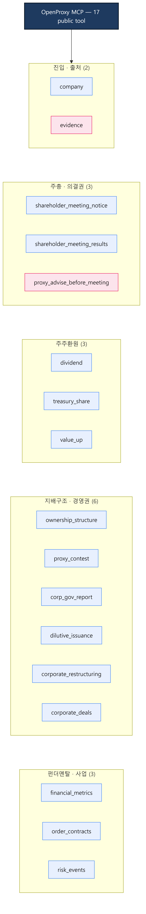
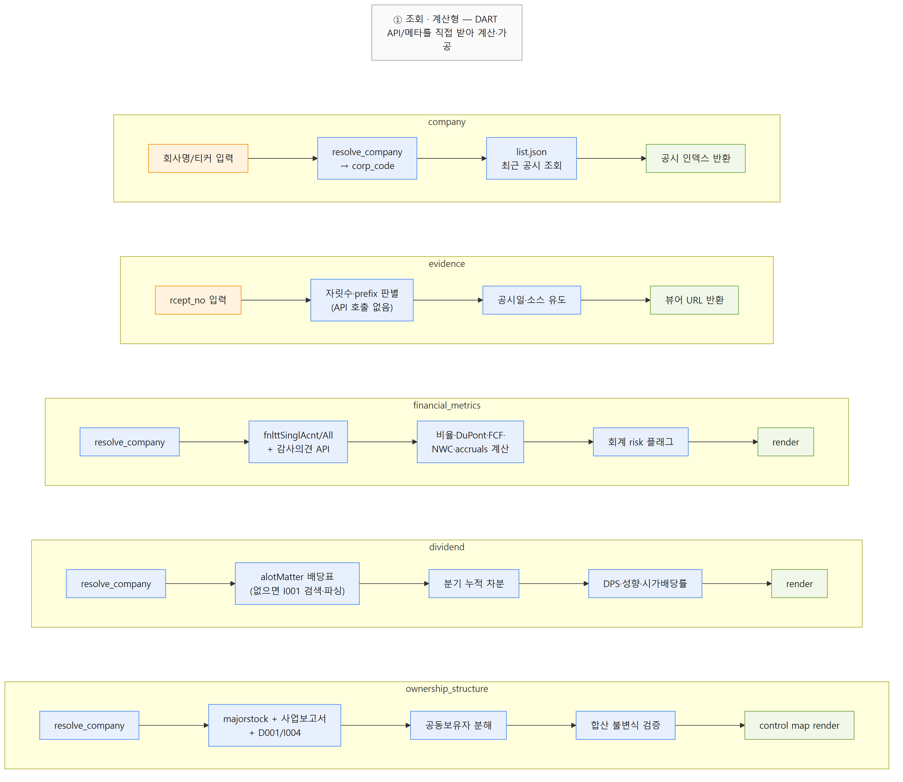
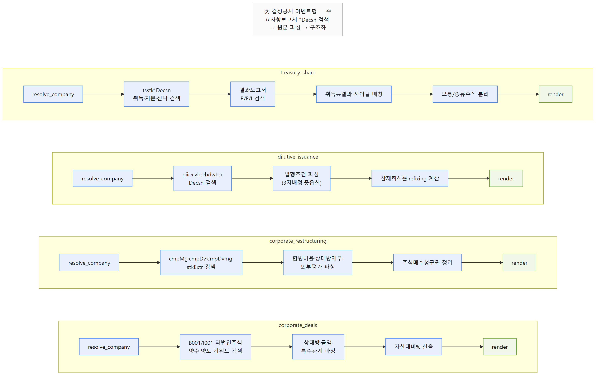
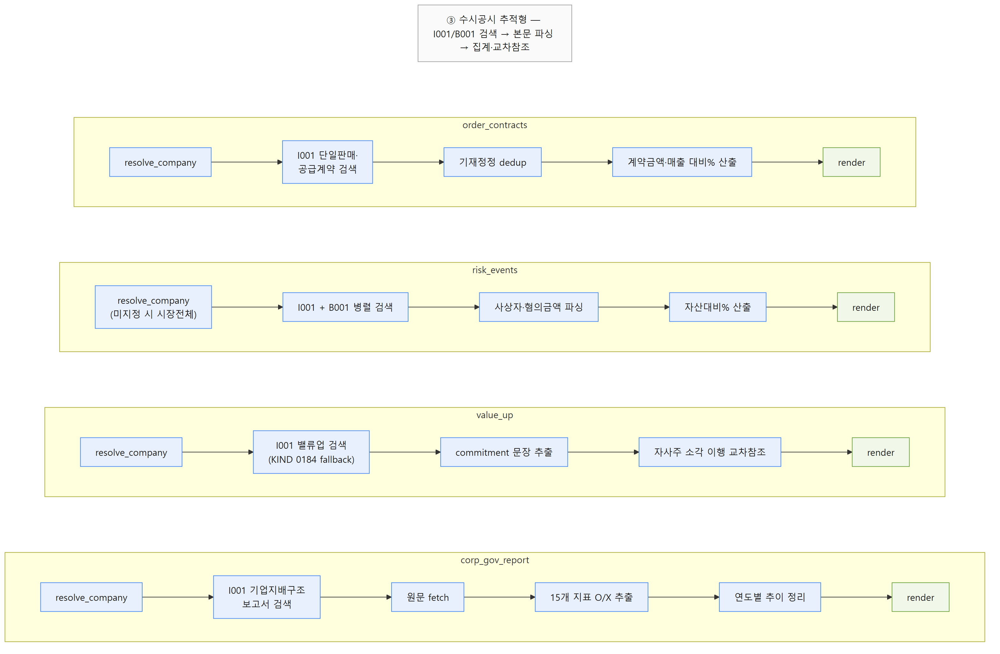
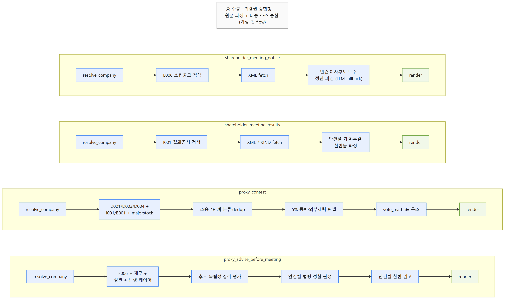
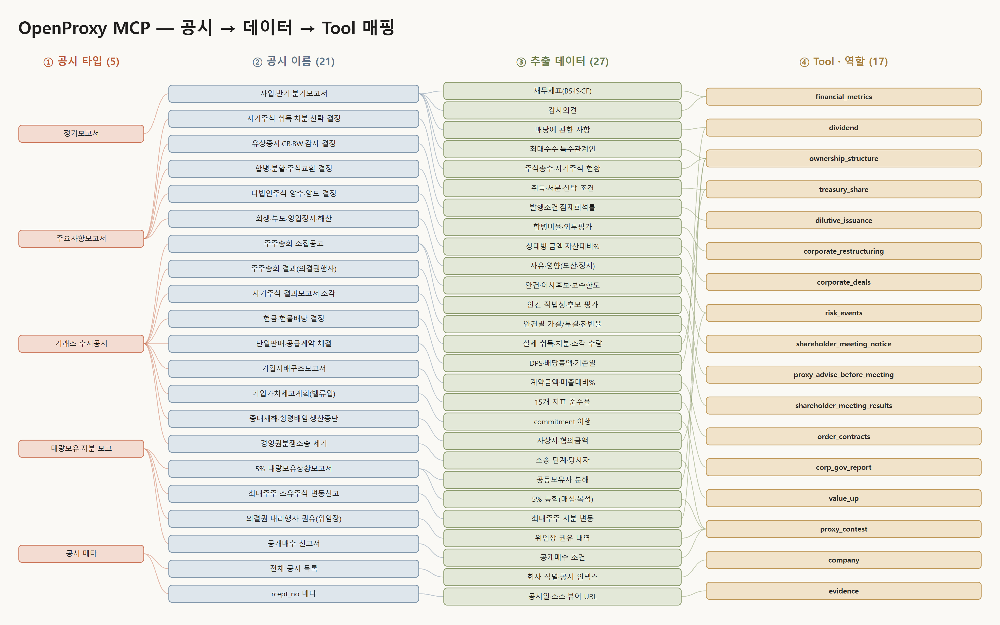

# 발표·설명 자료

> OPM을 소개·설명할 때 쓰는 시각 자료(도표·워크플로우 그림·PPT) 모음입니다. 원본 파일은
> `wiki/tools/diagrams/`에 있습니다. GitHub에서는 그림이 바로 보이고, PPT는 내려받아 사용합니다.

## 1. 시스템 구성도 — 17개 도구 분류

OpenProxy MCP의 17개 공개 도구를 6개 영역(진입·출처 / 주총·의결권 / 주주환원 / 지배구조·경영권 /
펀더멘탈·사업)으로 나눈 전체 구성도입니다. 어떤 도구가 어느 분석 영역을 담당하는지 한눈에 보여줍니다.

## 2. 워크플로우 도식

의결권 분석이 진행되는 흐름(도구 오케스트레이션 → 정규화 → 다단계 판단 → 근거 제공)을 단계별로
보여주는 도식입니다.

## 3. 도구–공시 매핑 (PPT)

각 도구가 어떤 전자공시(DART) 채널·서식에서 데이터를 가져오는지 매핑한 발표용 슬라이드입니다.

- 📊 **PPT 파일**: [`tool_disclosure_map.pptx`](../tools/diagrams/tool_disclosure_map.pptx) (내려받아 사용)
- 미리보기:

> 매핑 내용의 텍스트 버전은 [[tools/tool_disclosure_map]] (Mermaid 다이어그램)과
> [[tools/data_tool_disclosure_map]] (데이터 도구별 상세 매핑)에서도 볼 수 있습니다.

## 자료 목록 (원본 위치)

| 파일 | 형식 | 용도 |
|---|---|---|
| `tools/diagrams/architecture.png` | 그림 | 17개 도구 6영역 분류 구성도 |
| `tools/diagrams/workflow1~4.png` | 그림 | 분석 워크플로우 단계 도식 |
| `tools/diagrams/tool_disclosure_map.pptx` | PPT | 도구–공시 채널 매핑 슬라이드 |
| `tools/diagrams/ppt_preview.png` | 그림 | 위 PPT 미리보기 |

> 그림 소스(Mermaid 등)는 `tools/diagrams/src/`에 있습니다. 수정 시 소스를 고쳐 다시 내보냅니다.
