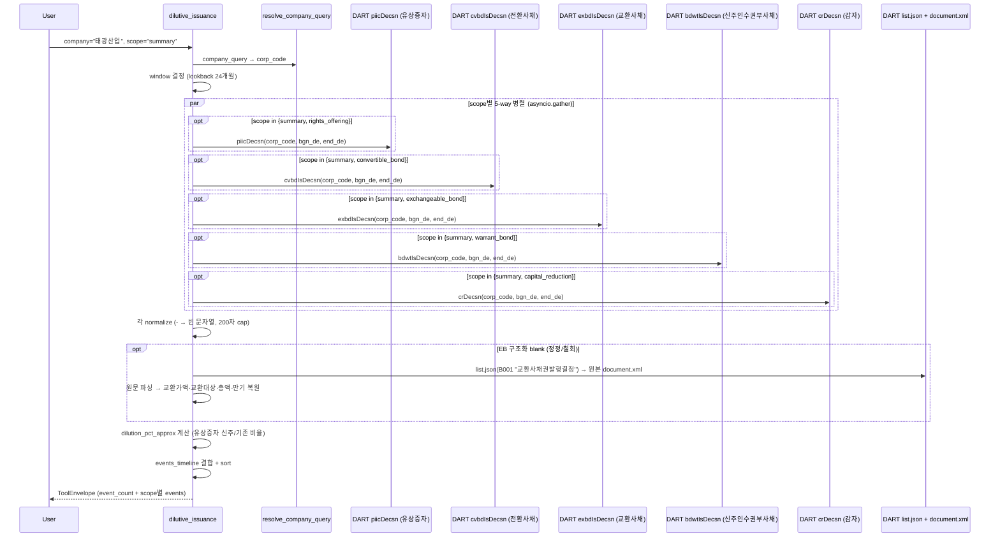

# dilutive_issuance

## 한 줄 요약
희석성 증권 발행 5종(유상증자/CB/EB/BW/감자) 결정 통합. 발행조건, 잠재 희석률, 3자배정 여부, 풋옵션, refixing 조항 같은 분석 핵심 수치 정형화. EB(교환사채)는 신주 희석이 아닌 **의결권 희석**(교환대상이 자기주식인 경우) 케이스를 포착하며, 정정·철회로 구조화 응답이 비면 원본 공시 문서를 파싱해 교환조건을 복원한다.

## 사용법
```
dilutive_issuance(
    company="EDGC",
    scope="summary",
)
```

자연어 예시:
- "EDGC 희석성 증권 (회생기업 패턴: 유상증자+CB+BW+감자)" → `scope="summary"`
- "하이퍼코퍼레이션 CB 잠재 희석" → `scope="convertible_bond"` (44.69% 심각)
- "나무기술 BW 발행조건" → `scope="warrant_bond"`

## 입력 인자
| 인자 | 타입 | 필수 | 설명 | 기본값 |
|---|---|---|---|---|
| company | str | yes | 회사명 / ticker / corp_code | - |
| scope | str | no | 5종 (아래 참조) | "summary" |
| start_date / end_date | str | no | YYYYMMDD | "" (24개월 lookback) |
| format | str | no | "md" / "json" | "md" |

scope:
- `summary`: 5종 통합 timeline (기본)
- `rights_offering`: 유상증자 카드 (배정방식, 희석률, 자금목적, 보호예수)
- `convertible_bond`: CB 카드 (전환가, 잠재 희석률, refixing, 풋옵션)
- `exchangeable_bond`: EB 카드 (교환가, 교환대상, 교환비율, 의결권 희석 경고, 정정/철회 시 원문 복원)
- `warrant_bond`: BW 카드 (행사가, 분리/비분리, 대용납입, 잠재 희석)
- `capital_reduction`: 감자 카드 (비율, 사유, 자본금 변화, 일정)

## 출력 schema (data dict)
```json
{
  "company_id": "...",
  "event_count": {"rights_offering": N, "convertible_bond": N,
                  "exchangeable_bond": N, "warrant_bond": N, "capital_reduction": N},
  "events_timeline": [{"rcept_dt": "...", "event_label": "...",
                       "headline_metric": "...", "rcept_no": "..."}],
  "rights_offering_events": [{"issuance_method": "...",
                              "new_shares_common": ...,
                              "dilution_pct_approx": ...,
                              "fund_purpose": {...}, "lock_up": {...}}],
  "convertible_bond_events": [{"bond_series": "...",
                               "total_issue_amount": "...",
                               "conversion": {"price": "...",
                                              "shares_if_converted": ...,
                                              "pct_of_total_shares": ...,
                                              "refixing_floor": "..."}}],
  "exchangeable_bond_events": [{"bond_series": "...",
                                "total_issue_amount": "...",
                                "exchange": {"price": "...", "rate": "...",
                                             "target": "자기주식 등",
                                             "target_share_count": "...",
                                             "pct_of_total_shares": ...},
                                "underwriter": "...",
                                "recovered_from_document": false,
                                "source_rcept_no": "...",
                                "latest_status_rcept_no": "...",
                                "recovery_note": "..."}],
  "warrant_bond_events": [{"warrant": {"exercise_price": "...",
                                       "detachable": "...",
                                       "pct_of_total_shares": ...}}],
  "capital_reduction_events": [{"reduction_ratio_common": "...",
                                "shares_reduced_common": ...,
                                "method": "...", "reason": "..."}],
  "no_filing": false,
  "filing_count": N,
  "usage": {"dart_api_calls": N, "mcp_tool_calls": 1}
}
```

핵심 지표:
- `dilution_pct_approx` (유상증자): 신주/기존 단순 비율 (근사, 원본 공시에 없어서 계산)
- `pct_of_total_shares` (CB/BW): DART 제공 필드, 발행주식 총수 대비 전환·행사 시 신주 비율
- `refixing_floor`: 시가 하락 시 전환가 하한 (낮을수록 희석 위험 증가)

## Data sources
- **DART API** (병렬 5개):
  - `piicDecsn.json` 유상증자
  - `cvbdIsDecsn.json` 전환사채 (CB)
  - `exbdIsDecsn.json` 교환사채 (EB)
  - `bdwtIsDecsn.json` 신주인수권부사채 (BW)
  - `crDecsn.json` 감자
- KIND/Naver 미사용. **기본 본문 파싱 없음** (API 응답만 정규화).
- **EB 원문 복원 예외**: EB 구조화 응답이 정정/철회로 비면(`bd_fta`·`ex_prc` 공란) `list.json`(B001, 키워드 "교환사채권발행결정")으로 원본 공시를 찾아 원문(`document.xml`)을 파싱해 교환가액·교환대상·총액 등을 복원. 원본부터 최대 4건까지 시도, blank가 없으면 추가 호출 0.
- 외부 호출: summary 5회 (DS005 5종 asyncio.gather 병렬) + EB blank 복원 시 list.json 1 + 문서 N. 기본 lookback 24개월.

## Flow



호출 횟수: scope=summary는 5회 병렬. 단일 scope는 1회. 본문 파싱은 EB가 정정/철회로 빈 경우에만 추가(list.json 1 + 문서 N).

## 파싱 전략
- DART 주요사항보고서(DS005) 5개 구조화 API. 모두 병렬 호출.
- API 응답 정규화: `-`, `해당사항 없음` → 빈 문자열.
- 긴 텍스트 필드 (`mg_rt_bs`, `ex_prc_dmth`) 200자 제한.
- **EB 보정 (`_ensure_eb_coverage`)**: DART 주요사항보고서 주요정보 API는 정정·철회 EB를 불완전하게 준다. 두 패턴 모두 대응:
  - **(A) blank stub** — 정정/철회 후 최신본만, 교환 조건은 공란(태광산업: 구조화 1건 전부 공란, list.json 체인 9건). → 원본 공시를 찾아 `document.xml` 파싱(`교환가액 (원/주)`·`교환대상 종류/주식수`·`권면(전자등록)총액 (원)`·`이사회결의일(결정일)`·`회차` 라벨줄→값줄)해 stub 행에 병합, `recovered_from_document=true`.
  - **(B) 0건 누락** — 첨부정정만 있는 체인은 구조화가 013(0건)을 줘 누락(한라IMS). → 구조화 EB가 blank이거나 0건이면 항상 `list.json`(B001 "교환사채권발행결정")로 존재를 확인하고, 있으면 원본 문서 파싱해 **새 EB 행 생성**.
  - **(C) detection-only** — 그 문서마저 `document.xml`이 없으면(첨부정정 014) 조건은 못 뽑아도 **"EB 공시 발견" 탐지 행**(`detection_only=true`)을 남겨 *누락(no_filing)으로 오인되는 것을 방지* + 경고. (한라IMS 실제 결과)
  - 비용: 구조화가 EB를 완전히 제공하면 list.json 생략(추가 0). blank/0건일 때만 list.json 1 + 문서 최대 4. 원본부터 시도.
- 알려진 한계:
  - 유상증자 `dilution_pct_approx`는 단순 근사 (정확한 희석률은 자사주 차감 등 보정 필요).
  - 제3자배정 대상자 명세는 본문 파싱 미수행 (TODO).
- regression 0 검증: 5/5 통과 (EDGC summary 7건 / 하이퍼코퍼레이션 CB / 나무기술 BW / EDGC rights 272% / EDGC capital_reduction 83.33%). 200기업 audit `dilutive_issuance.summary` 26.5% exact, no_filing 72.4% (사건 빈도 낮음 정상).

## 관련 공시 (rules/disclosures/)
- [[유상증자결정]] — DS005, 배정방식·신주 수·희석률
- [[전환사채발행결정]] — DS005, 전환가·잠재 희석·refixing
- [[교환사채권발행결정]] — DS005, 교환가·교환대상(자기주식)·의결권 희석·원문 복원
- [[신주인수권부사채발행결정]] — DS005, 행사가·분리형·대용납입
- [[감자결정]] — DS005, 감자비율·사유·일정

## 관련 개념 (rules/concepts/)
- [[지분구조]] — 3자배정 시 최대주주 변경 가능
- [[경영권-방어]] — CB/BW 사모 발행 → 우호 인수자에게 잠재 지분 부여

## 관련 결정 (decisions/)
- [[pblntf-ty-필터링]] — DS005 코드 사용
- [[cross-domain-체이닝]] — DIL → OWN (3자배정 지분 변동) / CORP (M&A 자금조달) / PRX (분쟁 자금조달) 체이닝

## 관련 audit/fix (architecture/)
- [[260429_0912_audit_parsing-200기업-v2-no_filing]] — dilutive_issuance.summary 26.5% exact (no_filing 72.4%)

## 알려진 issue + TODO
- 제3자배정 대상자 명세 본문 파싱 (TODO, phase 2).
- 감자 + 유상증자 세트 패턴 자동 감지 (TODO, EDGC 패턴 = 자본잠식 해소 → 3자배정 → 최대주주 변경).

## 변경 이력
- 2026-04-21: dilutive_issuance tool 신설 (13 → 14번째 tool, Data 9개째)
- 2026-04-21: 5/5 전수조사 통과
- 2026-04-29: 200기업 audit 26.5% exact (no_filing 72.4% 정상)
- 2026-05-01: tool wiki 페이지 작성
- 2026-06-24: 교환사채(EB, exbdIsDecsn) 5번째 타입 추가 + 정정/철회 blank 시 원문 복원. 태광산업 자기주식 교환사채(3,185.8억, 교환가 1,172,251, 자기주식 271,769주) 복원 검증.
