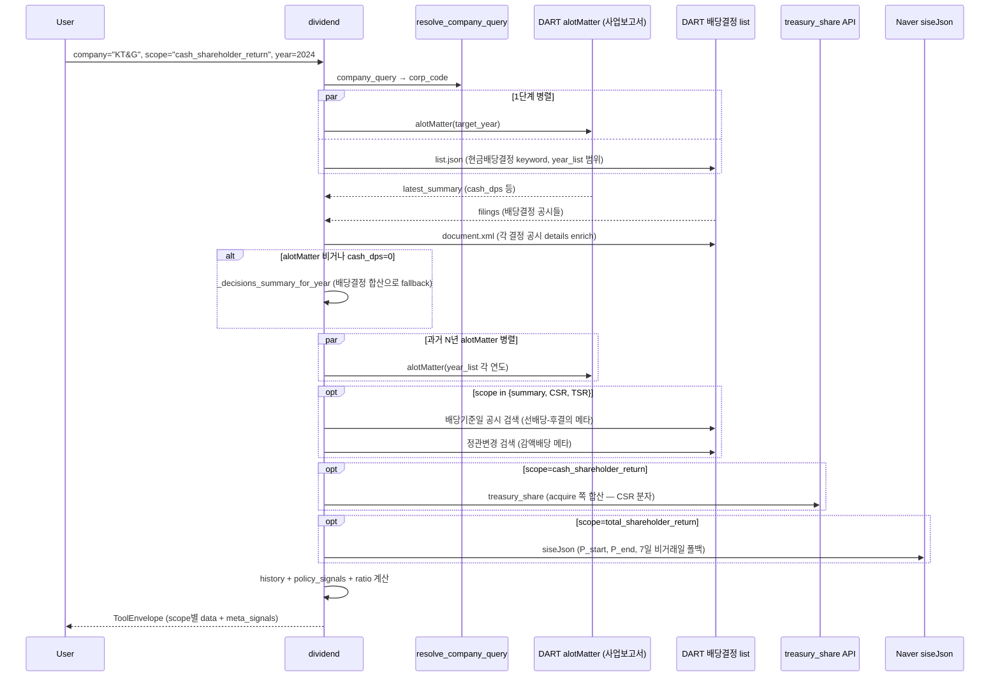

# dividend

## 한 줄 요약
실지급·확정된 배당 사실 탭. DPS, 총액, 배당성향, 시가배당률, 추이, CSR(한국식 배당+자사주 매입) + TSR(글로벌 주가+배당). 미래 정책·약속 X.

## 사용법
```
dividend(
    company="KT&G",
    scope="cash_shareholder_return",
    year=2024,
)
```

자연어 예시:
- "KT&G 한국식 환원율 2024" → `scope="cash_shareholder_return"` → CSR 92.21%
- "삼성전자 글로벌 TSR 2024" → `scope="total_shareholder_return"` → TSR -31.35%
- "메리츠금융지주 최근 3년 배당 추이" → `scope="history"`

## 입력 인자
| 인자 | 타입 | 필수 | 설명 | 기본값 |
|---|---|---|---|---|
| company | str | yes | 회사명 / ticker / corp_code | - |
| scope | str | no | 6종 (아래 참조) | "summary" |
| year | int | no | 사업연도, 0이면 최신 | 0 |
| years | int | no | history scope 누적 연수 | 3 |
| start_date / end_date | str | no | YYYYMMDD | "" |
| format | str | no | "md" / "json" | "md" |

scope:
- `summary`: 연간 DPS + 배당성향 + 시가배당률 + meta_signals (선배당-후결의, 감액배당) (기본)
- `detail`: 요약 + 최근 결정 10건
- `history`: 최근 N년 추이 (DPS / payout / yield / pattern)
- `policy_signals`: 분기배당·특별배당 패턴
- `cash_shareholder_return`: CSR (한국식, 배당+자사주 매입 / 지배주주 당기순이익)
- `total_shareholder_return`: TSR (글로벌, (P_end - P_start + DPS) / P_start)

## 출력 schema (data dict)
```json
{
  "company_id": "...",
  "summary": {"cash_dps": 1668, "cash_dps_preferred": null,
              "total_amount_mil": 11107906, "payout_ratio_dart": 25.1,
              "yield_dart": 1.5,
              "pre_dividend_post_resolution": false,
              "capital_reserve_reduction": false},
  "latest_decisions": [...],
  "policy_signals": {"trend": "...", "has_quarterly_pattern": true,
                     "has_special_dividend": false, "latest_change_pct": -3.2},
  "history": [{"year": 2024, "annual_dps": 1444, "decision_count": 4,
               "payout_ratio": 25.1, "yield_pct": 1.5, "pattern": "..."}],
  "cash_shareholder_return": {"csr_pct": 92.21, "definition": "...",
                              "dividend_total_krw": ..., "buyback_total_krw": ...,
                              "cash_return_total_krw": ..., "net_income_krw": ...,
                              "ratio_status": "computed",
                              "components": {...}, "acquisition_rows": [...]},
  "total_shareholder_return": {"tsr_pct": 25.98, "definition": "...",
                               "components": {"price_start_krw": 89300,
                                              "price_end_krw": 107100,
                                              "dps_total_krw": 5400,
                                              "price_change_pct": 19.93,
                                              "dividend_yield_pct": 6.05},
                               "ratio_status": "computed",
                               "sources": {"price": "naver", "dps": "alotMatter"}},
  "no_filing": false,
  "filing_count": N,
  "usage": {"dart_api_calls": N, "mcp_tool_calls": 1}
}
```

핵심 필드:
- **CSR vs TSR 분리**: CSR(회사 회계, 분모=지배주주 당기순이익) vs TSR(투자자 1주 수익률, 분모=P_start). 같은 "주주환원" 단어지만 정의 다름.
- `ratio_status`: `computed` / `denominator_zero_or_unknown` / `negative_net_income` / `missing_price_data`
- meta_signals: 선배당-후결의 (2024 신법), 감액배당 cross-link (자본준비금 감소)

> **갱신 (2026-06-09)** — 정확도/분류 정밀화:
> - **분기별 누적차분** (`quarterly_full`, 최신연도): 분기/반기/사업보고서 누적값을 차분(Q2=반기-Q1…)해
>   보통+우선 DPS·배당총액 산출. 결정공시 버킷팅(경계 오귀속·예비결산 중복)보다 정확, 무배당 분기 0·특별배당 포착. [[배당공시유형]] §7.
> - **최신연도 4분류**: 중간배당 확정 / 확정 전(D 명부폐쇄 기준일 매칭) / 미공시(payer인데 결산 미확정) / 무배당(직전도 배당 없음). target연도 매칭으로 단정.
> - 권위 = 사업보고서 alotMatter **다년컬럼**(개별연도 호출 제거). per-decision 시가배당률은 0 억제(연간값 권위).
> - ⚠️ **CSR/TSR scope 폐기** — 현재 scope = `summary` / `detail` / `history`만. 아래 CSR/TSR 설명은 구버전.
> - 상세 교훈: 레슨 `lessons/dividend-source-of-truth-260609`.

## Data sources
- **DART API**: `alotMatter` (사업보고서, 1차 source), `현금ㆍ현물배당결정` 공시 합산 (alotMatter 비거나 cash_dps=0일 때 fallback)
- **treasury_share API**: `tsstkAqDecsn` (CSR 분자, 매입 acquire 시점 — 소각 retire 아님)
- **Naver Finance**: `siseJson` (TSR P_start/P_end, 7일 비거래일 자동 폴백)
- **KRX Open API**: 시세 fallback
- 외부 호출: summary 13회 (배당결정 공시 N건 본문), history 21회 (+ 분기교정)

## Flow



호출 횟수: summary 13회 (배당결정 공시 N건 본문, 최대 12), history 21회 (+ 분기교정 8).

## 파싱 전략 / source of truth

### 신뢰도 순위 (어떤 공시의 어떤 값을 믿는가)
1. **사업보고서 alotMatter `주당 현금배당금(원) · 보통주`** — 최우선, 연간 DPS·배당성향·시가배당률의 source of truth.
   - **최신 보고서 1회 응답의 당기/전기/전전기 컬럼**으로 최근 3개 사업연도를 한 번에 확보 (`_alot_multiyear_summaries`). 분기+결산이 이미 연간으로 합산돼 있고, 단일 출처·동일 기준이라 연도 간 일관. 자회사·정정 오염 없음. **문서 파싱 0회.**
   - 배당성향은 `(연결)현금배당성향(%)`, 시가배당률은 `현금배당수익률(%) 보통주` 컬럼 사용.
   - ⚠️ `주당 현금배당금` 행이 보통주 뒤에 **빈 행(stock_type="-")**으로 한 번 더 오면, 빈 값("-"→0)이 실제값을 덮어쓴다 → "보통주 명시 or 값>0"일 때만 반영 (메리츠금융지주·셀트리온·에이피알 케이스).
   - ⚠️ 최신 사업연도는 보고서 확정 전까지 컬럼이 "-"일 수 있음(선배당-후결의·미확정) → 그 해만 결정공시 fallback.
2. **현금ㆍ현물배당결정 거래소공시 (XML 본문 파싱)** — 보조.
   - 용도: (a) **분기별 breakdown** (alotMatter엔 분기 분해 없음), (b) alotMatter 빈 신규/최신연도 **fallback**, (c) 분기/연간 **패턴 판정**.
   - 합산 시 필수: **자회사(`자회사의 주요경영사항`) 제외** (지주사 DPS 과대계상 주원인) + **정정/재공시 dedup** (`_effective_decisions`, `(사업연도,분기,기준일)` 최신 1건).
   - ⚠️ 연간 **합산** 신뢰도 낮음: 결산배당이 기지급 분기를 차감한 "잔액"으로 적히는 등 단순 합이 실제 연간과 다름 → 연간 수치는 항상 alotMatter(1) 우선.
3. **연도별 alotMatter 개별 호출** — **지양**. 특정 연도 단독 호출은 배당성향/수익률만 있고 DPS=0을 반환하는 경우가 있음(KB금융 2023 단독 호출). (1)의 다년 컬럼으로 대체.

### 타겟팅 (cap 방식 아님)
- 검색: 기간(`bgn_de`/`end_de`) + 공시유형 `I001` (서버) → 제목 `"배당결정"` 포함 + `"자회사"` 제외 (클라이언트, DART가 제목 서버검색 미지원).
- 거른 집합이 곧 "그 기간 모회사 배당결정 공시 전부"라 양이 작다(분기배당사 ~연 4건). **임의 cap 없이 타겟된 공시만 파싱** — 구버전 raw `[:20]` 절단(오래된 연도 통째 누락) 제거.

### CSR 분자 정정 (T22 → T23):
  - T22: 자사주 소각(retire) 사용 — 잘못 (이중 계산 / 시점 어긋남)
  - T23: 자사주 매입(acquire) 사용 — 정정 (이사회 결의 시점 현금 유출)
  - 검증: KT&G 119.23% → 92.21%, 삼성전자 2024 29.18% → 38.10%, 2025 31.98% → 40.71%
- [기재정정] dedupe (board_date+amount+shares 키)
- 정책 예측·미래 약속 추가 금지 (그건 `value_up`)
- regression 0 검증: 200기업 audit `dividend.summary` 75.0% exact (147/196), no_filing 24.0% (47건, KOSDAQ 무배당 정상). 21지표 audit 통과.

## 관련 공시 (rules/disclosures/)
- [[현금배당결정]] — DPS / 기준일 / 시가배당률 (1차 source)
- [[주식배당결정]] — 1주당 배당주식수
- [[배당기준일결정]] — 선배당-후결의 시그널 (2024 신법)
- [[분기배당결정]] — 연간 DPS = 1Q+반기+3Q+결산
- [[감액배당결정]] — 자본준비금 감소 → 이익잉여금 전입 → 배당 (cross-link)
- [[배당공시유형]] — 배당 6종 통합 인덱스
- [[사업보고서]] — alotMatter 배당 요약
- [[자기주식취득결정]] — CSR 분자 source (acquire)

## 관련 개념 (rules/concepts/)
- [[배당성향]] — 배당금 총액 / 지배주주 귀속 당기순이익
- [[배당수익률]] — 주가 대비 배당금 비율
- [[시가배당률]] — DART 공식 (배당기준일 전전거래일 1주 평균)
- [[분기배당]] — 분기별 중간배당, DPS 합산 주의
- [[특별배당]] — 일회성, 추이 분석 시 정기와 분리
- [[감액배당]] — 자본준비금 감소 후 이익잉여금 전입
- [[자본준비금]] — 감액배당 전제 조건
- [[당기순이익]] — CSR 분모 (반드시 연결 지배주주 귀속)
- [[주주환원]] — CSR(한국식) vs TSR(글로벌) 정의 분리

## 관련 결정 (decisions/)
- [[배당공시유형]] — 배당 9종 + 자사주 5종 + 2026.03 신법 통합 비교
- [[DART-KIND-매핑-화이트리스트-2026-04]] — KIND whitelist 정책
- [[free-paid-분리]] — DPS 일관성
- [[cross-domain-체이닝]] — DIV → VUP / TRS 체이닝

## 관련 audit/fix (architecture/)
- [[260429_0912_audit_parsing-200기업-v2-no_filing]] — dividend.summary 75.0% exact
- [[260429_0216_fix_speed-optimization-9건]] — dividend 3x 속도 향상 (asyncio.gather)
- [[260429_0942_audit_arithmetic-21지표]] — 21개 산술 지표 검증 통과

## 알려진 issue + TODO
- alotMatter와 거래소 공시 수치 충돌 시 `requires_review`.
- 특별배당 비정형 금액 구조 → `requires_review`.
- 시가배당률 비고 + 가격 fallback 실패 시 `requires_review`.
- 이항(우선주) 배당은 `cash_dps_preferred`로 별도 노출.
- **선배당-후결의(2024 신법) 회사**(예: 메리츠금융지주): 금액이 든 `현금ㆍ현물배당결정` 거래소공시 없이 `주주명부폐쇄 기준일설정`만 하고 주총/사업보고서로 확정하는 케이스가 있다. 최신 사업연도가 결정공시·alotMatter 모두 비면 → (2026-06-08 개선) `pre_dividend_post_resolution` 신호가 True 일 때 history 패턴을 `무배당` 대신 **`확정 전 (배당기준일 설정·금액 미정)`** 으로 표기하고 `pending_confirmation:true` + warning 부착. 추세(policy_signals)는 확정 연도만으로 계산해 미확정 연도의 DPS=0 이 −100% 로 왜곡하는 것 방지. 진짜 무배당(신규상장 등 기준일 공시 자체가 없음)은 신호 False 라 그대로 `무배당`(에이피알 검증).

## 변경 이력
- 2026-04-18: dividend tool 검증 + release_v2 go
- 2026-04-19: 3개 기업 (삼성전자 / KT&G / 메리츠금융지주) summary 통과
- 2026-04-29: CSR 분자 정정 (T22 retire → T23 acquire), TSR 신규 scope 추가
- 2026-04-29: 200기업 audit 75.0% exact (no_filing 분리)
- 2026-05-01: tool wiki 페이지 작성
- 2026-06-08: 연간 DPS/배당성향/수익률 source를 **alotMatter 다년 컬럼**(`_alot_multiyear_summaries`)으로 전환 — per-year 개별 호출·결정공시 합산 의존 제거. 더해서 ① 자회사(`자회사의 주요경영사항`) 공시 제외 ② 정정/재공시 dedup(`_effective_decisions`) ③ raw `[:20]` 절단 제거(기간·유형·제목 타겟) ④ `주당 현금배당금` 빈 행 overwrite 버그 수정. 검증: KB금융 3,060/3,174/4,367, 삼성전자 1,444/1,446/1,668, 미래에셋 150/250/300, SK하이닉스 1,200/2,204/3,000, 셀트리온 500/750/750, 메리츠 2,360/1,350(2025 미확정) — 사업보고서 권위값·분기합 일치.
- 2026-06-08: 선배당-후결의 회사 최신연도 `무배당` → `확정 전 (배당기준일 설정·금액 미정)` 표기 + `pending_confirmation` 플래그, 추세는 확정연도만 산정 (메리츠 2025 검증, 에이피알 진짜 무배당 오탐 없음).
- 2026-06-08: history 정합성 경고 추가 — 분기 breakdown 합(정정 제외) ≠ 사업보고서 연간 DPS 인 해에 warning. 깜깜이배당 해소 전환기(전년 결산 + 올해 Q1 동시 공시, 결산 기준일 이월)에 공시별 fiscal-year 추론이 경계에서 어긋나는 케이스 — 연간값(사업보고서)이 정확함을 명시 (하나금융지주 2023: 분기합 2,800 vs 연간 3,400 검증, KB·삼성·기아 오탐 없음).
