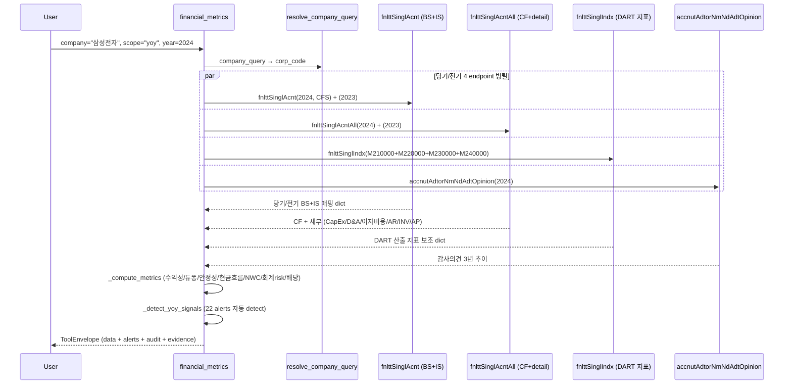

# financial_metrics

## 한 줄 요약
DART 재무 4 endpoint 통합 — 수익성/안정성/현금흐름/운전자본 회전일수/회계 risk 지표. 한국 표준(연결, 지배주주 귀속). 듀퐁 3단 분해, FCF, NWC, CCC, accruals_gap, 감사의견 추이 자동 산출.

## 사용법
```
financial_metrics(
    company="삼성전자",
    scope="yoy",
    year=2024,
)
```

자연어 예시:
- "롯데케미칼 2024 yoy 분석" → `scope="yoy"` → operating_loss + interest_coverage_low + negative_fcf alerts
- "SK하이닉스 turnaround 검증" → `scope="yoy"` → turnaround alert
- "삼성전자 듀퐁 분해 + ROE 구성" → `scope="summary"` → ROE 13.07% = 16.63% × 0.62 × 1.27
- "오스템임플란트 5년 감사의견" → `scope="audit_opinion"`

## 입력 인자
| 인자 | 타입 | 필수 | 설명 | 기본값 |
|---|---|---|---|---|
| company | str | yes | 회사명 / ticker / corp_code | - |
| scope | str | no | 6종 (아래 참조) | "summary" |
| year | int | no | 사업연도, 0이면 최신 완료 사업연도 | 0 |
| years | int | no | yearly/audit_opinion 누적 연수 | 3 |
| consolidated | bool | no | True=CFS(연결, 한국 표준), False=OFS(별도) | True |
| format | str | no | "md" / "json" | "md" |

scope:
- `summary`: 1 사업연도 56개 핵심 지표 (수익성/듀퐁/안정성/현금흐름/운전자본/회계risk/배당유보/NAV)
- `yearly`: 최근 N년 추이 (revenue/op_profit/net_income/OPM/ROE/debt_ratio/CFO/FCF)
- `quarterly`: 최근 12분기 추이 (4Q × 3년 — Q1/Q2 반기/Q3/Q4 사업)
- `yoy`: 전년 대비 + 22개 alerts + 감사의견 cross-check
- `qoq`: 전분기 대비 (operating_loss_quarter / revenue_decline_qoq alerts)
- `audit_opinion`: 감사의견 3년 추이 (적정/한정/부적정/감사인 변경 추적)

## 출력 schema (data dict)
```json
{
  "company_id": "cmp_005930",
  "scope": "summary",
  "year": 2024,
  "fs_div": "CFS",
  "consolidated": true,
  "summary": {
    "revenue_krw": 300870903000000,
    "operating_profit_krw": 32725961000000,
    "operating_margin_pct": 10.88,
    "net_income_krw": 50048199000000,
    "ebitda_krw": 32725961000000,
    "ebitda_margin_pct": 10.88,
    "roe_pct": 13.07, "roa_pct": 10.31, "roic_pct": 6.15,
    "asset_turnover_ratio": 0.62, "equity_multiplier": 1.27, "roe_dupont_pct": 13.07,
    "debt_ratio_pct": 27.93, "current_ratio_pct": 243.30,
    "interest_coverage_ratio": 2.52, "net_cash_krw": 40518545000000,
    "cfo_krw": 72982621000000, "capex_krw": 51406355000000,
    "fcf_krw": 21576266000000, "fcf_margin_pct": 7.17,
    "cfo_to_op_ratio": 2.23, "cfo_to_net_income_ratio": 1.46,
    "working_capital_krw": 133735967000000, "nwc_krw": 83007761000000,
    "nwc_change_yoy_krw": 6054318000000, "nwc_to_revenue_pct": 27.59,
    "days_sales_outstanding": 52.9,
    "days_inventory_outstanding": 88.1,
    "days_payable_outstanding": 42.4,
    "cash_conversion_cycle_days": 98.6,
    "accruals_gap_pct": -123.01,
    "ar_to_revenue_pct": 14.50, "inv_to_revenue_pct": 17.20,
    "dividend_paid_krw": 10888749000000, "payout_ratio_pct": 21.76,
    "retained_earnings_krw": 370513188000000, "nav_krw": 402192070000000,
    "eps_krw": 4950, "diluted_eps_krw": 4950
  },
  "yoy": {"current": {...}, "prior": {...}, "alerts": ["accruals_red", "nwc_efficiency_low"],
          "audit_opinion": {"current": {...}, "prior": {...}}},
  "audit_opinion": {"opinions": [{"stlm_dt": "2024-12-31", "adt_opinion": "적정의견",
                                  "adtor": "삼정회계법인", "core_adt_matter": "..."}],
                    "summary": {"latest_opinion": "적정의견", "all_clean": true}},
  "no_filing": false, "filing_count": 1,
  "usage": {"dart_api_calls": 12, "mcp_tool_calls": 1}
}
```

핵심 필드:
- **단위 처리**: 모든 금액 raw KRW int (`_krw` suffix), %는 float (`_pct` 11.5 = 11.5%), 비율은 decimal (`_ratio` 0.85). render에서만 조/억 변환.
- **연결 default**: 한국 표준 = 연결 지배주주 귀속. `consolidated=False` 옵션으로 별도 가능.
- **분모 0/음수 graceful**: 적자 회사 ROE/배당성향 → None + warning. 분모 음수일 때 산출 안 함.

## yoy_signals (25개 alerts)
- **수익성**: `loss_conversion`, `operating_loss`, `turnaround`, `continued_loss`, `revenue_decline`
- **부채/유동성**: `debt_surge`, `interest_coverage_low`
- **자본잠식 (KOSDAQ 관리/폐지 사유)**: `capital_impairment_partial` (잠식률 0~50%), `capital_impairment_50plus` (50%+, KOSDAQ 관리종목 사유), `capital_impairment_full` (완전 자본잠식, 상장폐지 사유)
- **현금흐름**: `cfo_quality_red`, `negative_fcf`, `low_dividend_capacity_use`
- **운전자본**: `nwc_surge`, `nwc_efficiency_low`
- **듀퐁 분해**: `roe_driven_by_leverage`, `roe_decline_margin_driven`, `roe_decline_turnover_driven`
- **회계 risk**: `accruals_red`, `receivables_surge`, `inventory_surge`
- **감사의견**: `non_clean_audit_opinion`, `audit_opinion_change`
- **배당**: `dividend_halt`

### 자본잠식 정의 (한국 상법/거래소 기준)
- **자본금**: 발행주식수 × 액면가 (회사 설립 + 증자로 들어온 원금)
- **자본총계**: 자본금 + 자본잉여금 + 이익잉여금 (현재 회사가 보유한 순자산)
- **자본잠식**: 누적 적자로 이익잉여금이 음수가 되어 자본총계가 자본금보다 작아진 상태
- **잠식률**: (자본금 - 자본총계) / 자본금 × 100
- **trigger**:
  - 잠식률 50%↑ + 2년 연속: KOSDAQ 관리종목 지정
  - 완전 자본잠식 (자본총계 ≤ 0): KOSDAQ 상장폐지 사유 (KOSPI는 사업보고서 미공시 등 다른 trigger)

## Data sources
- **DART API 4 endpoint**:
  - `fnlttSinglAcnt` (단일회사 주요계정) — BS 9 + IS 5 = 14 핵심 행. 당기/전기/전전기 3년 단일 호출.
  - `fnlttSinglIndx` (주요 재무지표) — DART 산출 ROE/부채비율/EPS 등. idx_cl_code 4 그룹 (수익성/안정성/성장성/활동성) × 4 호출.
  - `fnlttSinglAcntAll` (전체 재무제표) — 213 행 (BS/IS/CIS/CF/SCE). CapEx, 감가상각비, 이자비용, 매출채권/재고/매입채무 추출.
  - `accnutAdtorNmNdAdtOpinion` (회계감사인+의견) — 6 행 (3년 × CFS+OFS). 감사인 / 적정의견 / 강조사항 / 핵심감사사항(KAM) / rcept_no.
- 외부 호출: scope별 4-12회. summary는 8-9회 (당기/전기 acnt + acntAll + indx 4그룹), yoy는 12-14회.

## Flow



호출 횟수: scope별 4-14회. yoy는 가장 많음 (당기/전기 모두 + 감사). audit_opinion만은 1회.

## 파싱 전략
- **account_nm 매칭**: 표준 키워드 패턴 9 BS + 5 IS + 13 detail (CF/Detail). 공백 무관 + 부분 일치.
- **금액 정규화** (`normalize_amount`):
  - 콤마 strip ("227,062,266,000,000" → 227062266000000)
  - 괄호 음수 ("(500)" → -500, T19 fix 패턴)
  - None / "-" / "" → None graceful
- **DART 응답 단위**: 표준 = 원 raw int, 일부 KOSDAQ은 백만원 단위 (`_unit` 메타로 자동 곱셈 — Phase 2)
- **연결 지배주주 귀속**: detail에 `controlling_interest_income` 있으면 우선 사용, 없으면 `당기순이익(손실)` 합계 fallback
- **평균자산/평균자본**: 당기 + 전기 BS 평균. 전기 데이터 없으면 기말 단독.
- **ROIC 근사**: NOPAT = 영업이익 × (1 - 0.22 평균법인세). 투하자본 = 자본 + 총차입.
- **DuPont 검증**: ROE = 순이익률 × 자산회전율 × 재무레버리지. roe_pct vs roe_dupont_pct 일치 확인용.
- **운전자본 회전일수**: DSO=평균 매출채권/매출액×365, DIO=평균 재고/매출원가×365, DPO=평균 매입채무/매출원가×365, CCC=DSO+DIO-DPO. 분모가 없거나 0 이하이면 None.

## 관련 공시 (rules/disclosures/)
- [[사업보고서]] — fnlttSinglAcnt 1차 source (연간)
- [[반기보고서]] — reprt_code=11012
- [[분기보고서]] — reprt_code=11013(1Q) / 11014(3Q)

## 관련 개념 (rules/concepts/)
- [[당기순이익]] — 한국 표준 = 연결 지배주주 귀속
- [[배당성향]] — 배당총액 / 지배주주 귀속 당기순이익
- [[ROE]] / [[ROA]] / [[ROIC]] — 수익성 3대 지표
- [[듀퐁분석]] — ROE = 순이익률 × 자산회전율 × 재무레버리지
- [[FCF]] — Free Cash Flow = CFO - CapEx
- [[NWC]] — 순운전자본 = 매출채권 + 재고 - 매입채무
- [[이자보상배율]] — 영업이익 / 이자비용
- [[순현금]] — 현금성자산 - 총차입금

## 관련 결정 (decisions/)
- [[open-proxy-guideline]] — 재무 risk 신호 (이자보상배율, FCF 음수 등) 채점에 사용
- [[cross-domain-체이닝]] — financial_metrics → vote_brief / corp_gov_report 체이닝 (Phase 2)

## 관련 audit/fix (architecture/audits/)
- [[260510_financial_metrics_audit_통합정리]] — 6기업 sanity부터 200기업 전수까지 통합 정리
- [[260501_2030_audit_financial_metrics-200기업]] — 200기업 기준 문서

## 알려진 issue + TODO
- 일부 KOSDAQ 회사 백만원 단위 보고 — `_unit` 메타 자동 곱셈 (Phase 2)
- 감가상각비 (CF "비현금항목 가산") 패턴 일부 회사에서 매칭 안 됨 → EBITDA = 영업이익으로만 산출되는 케이스
- 이자비용 vs 금융비용 모호 — 일부 회사 금융비용에 환차손 포함 → 이자보상배율 underestimate
- 발행주식수는 별도 호출 필요 (BPS 산출 — Phase 2 stockTotqySttus 통합)
- vote_brief / 매트릭스 dim 자동 채점 통합 — **Phase 2 별도**

## 변경 이력
- 2026-06-12: **quarterly/qoq standalone 차분 + QoQ·YoY 기본 동봉.** Q4 행이 사업보고서 연간 누적치로 채워져 QoQ 비교·`revenue_decline_qoq` alert가 왜곡되던 버그 수정 (실사용 발견 — SK하이닉스 26Q1 질의에서 호스트 모델이 수동 보정에 장시간 소모). DART 필드 실측: Q1~Q3 `thstrm_amount`=3개월 standalone, `thstrm_add_amount`=누적, 연간(11011)=누적 → **Q4 = 연간 − Q3 누적(add) 차분** (dividend 누적차분 패턴 재사용, 결측 시 Q1~3 합 fallback + `annual_cumulative` flag·warning). 전 행에 `qoq_pct`/`yoy_pct`(매출·영업이익·순이익) 기본 동봉 — 전기 적자·결측 시 None. BS 항목은 시점값이라 차분 제외. 검증: SK하이닉스(25Q4 32.8조, 26Q1 QoQ +60.2%/YoY +198.1%, false alert 해소)·삼성전자·LG디스플레이(적자 분기 None 처리), **3사 전 연도 '4분기 합 = 연간' 불변식 통과**.
- 2026-06-12: EBITDA 표시 정책 — 산출 불가(76%) 시 "산출 불가" 안내 대신 **줄 자체 생략** (결측 광고가 hedge처럼 읽히는 문제). CapEx/감가상각비 줄 동일. JSON 필드(`ebitda_krw` nullable)는 유지 — 산출 가능 24%에선 그대로 제공.
- 2026-06-12: **시장 412사 × FY24·25 다차원 전수 audit** (KOSPI 시총 300 + KOSDAQ 100 + 엣지 12, 회사당 10콜·총 ~4,200콜, raw: [[260612_fm_market_audit_412|audits/data/260612_fm_market_audit_412.json]]).
  | 차원 | 결과 |
  |---|---|
  | 정합(분기합=연간) | 측정 385~397사 중 **일치 95%+**, >0.5% 차이 13~14사(재작성·분할 — gap flag 전부 포착) |
  | 연결/별도 | OFS-only 24~28사(6%) — fs_div 필터 fallback 실사용 확인 |
  | 시점 | 분기 전체 면제(리츠·신규상장) 4~6사 — annual_cumulative 경로 정상 |
  | 금융사 | 매출 None 28~31사 — warning 커버 |
  | CFO/CapEx | 91% / 96% 추출 |
  교정 2건: ① **이자지급 변형 정확일치 세트**(`이자지급(영업)`·`이자지급`·`이자비용지급`·CF `이자비용` 등 — substring 금지로 신종자본증권 FP 차단) → 이자보상 분모 미확보 153사 중 **143사 회복(93%)**, 커버리지 59%→97%. ② **"차입부채"(금융사형) generic 합산 추가** → 85사 중 18사 회복. 의도적 미채택: `단기/장기금융부채` 류(파생·기타부채 포함, 차입금 과대계상 위험), D&A 24%는 원천 한계(다수 회사가 CF에 '조정' 합계로만 공시 — probe 30사에 상각 행 부재 확인) → EBITDA는 산출 가능 시만 정책 유지.
- 2026-06-12: **summary 정합 audit + 실사용(SK하이닉스 현금흐름·건전성 질의) 후속 5건.** 핵심 불변식(FCF=CFO−CapEx·듀퐁곱=ROE·부채비율·순현금·마진)은 6사 전부 통과. 교정: ① **EBITDA** — CF에 감가상각비를 '조정' 합계로만 공시하는 회사(삼성전자류)는 D&A 미추출인데 OP+0=OP로 표시되던 것 → D&A 추출 시에만 산출(아니면 None + 렌더 안내), D&A 패턴 변형 추가. ② **이자보상배율** — '금융비용' fallback이 환손·평가손 총액을 잡아 왜곡 (SK하이닉스 3.77배→실제 50.3배, 삼성전자 3.72배→92.8배): IS 이자비용 → CF '이자의 지급' fallback으로 교체, 느슨한 "이자지급" 패턴은 신종자본증권 0원 행 선매칭(POSCO 실측)이라 제거. ③ **총차입금** — 계정명이 generic "차입금"인 회사(SK하이닉스 유동·비유동 각 1행) 합산 fallback(`borrowings_generic`). ④ **분기 fallback 연도 CF 결측** — acnt_all이 11011 고정이라 used_rc 미전파 → 전파 수정 (SK하이닉스 2026 CFO 26.3조 복구). ⑤ 정상 기업 잠식률 표시 정리(앞 항목). 순이익>영업이익(SK하이닉스 26Q1)은 파싱 오류 아닌 실데이터로 확정 — 금융수익 17.06조(이자수익+환·평가익) − 금융비용 3.02조 + 법인세 11.27조 구조.
- 2026-06-12: **4차 audit — 코스닥 16사 (시총 상위 8 + 기술특례 적자·거래정지 이력·CB 다발 등 엣지 8)** — 루닛 실측으로 gap 검사 사각 발견: 매출 합은 일치하는데 영업이익·순이익만 불일치(중단영업 재분류 류는 손익 하단에만 영향) → **gap 검사를 손익 3개 키 전체로 확장**, `quarters_sum_gaps`(키별 %) 추가. 효과: LG화학 영업이익 0.79% warning 포착(매출만 볼 땐 침묵), 카카오게임즈 2024 영업이익 41.9% 대형 재작성 경고. 이오플로우 5분기 연속 음수자본·펄어비스 부분 매출 None은 원천 그대로 정직 노출. **누적 검증 74사.**
- 2026-06-12: **3차 audit — normal 10 + edge 10 (신규 20사)** — LG화학 2025 미세 재작성(0.09%, 498억) 발견 → **gap flag 이원화**: 기계용 `quarters_sum_gap_pct`는 >0.01%면 기록(모델 합산 검산 혼란 방지), 사람용 warning은 >0.5%만(미세 조정 침묵). 삼성SDI 2024 4.1% 재작성 flag, 금융지주 3사(하나·우리·한화생명) warning 정상, HMM·카카오페이·SK바이오팜·동국홀딩스(분할 지주전환) 전부 불변식 통과. **누적 검증 58사.**
- 2026-06-12: **엣지 2차 10사 audit (비12월 결산 리츠·신규상장 2·분할합병 재편·인터넷은행·한국상장 외국법인·한전·거래정지 이력 바이오·SPAC)** — hard fail 0. 더본코리아(24.11 상장)는 상장 전 분기 결측인 2024-Q4만 `annual_cumulative` 표기 후 2025부터 정상 차분, 두산로보틱스(대규모 분할합병)도 분기 합=연간 일치, 신라젠 -1,650% 마진은 매출 미미 바이오의 실수치(왜곡 아님), 카카오뱅크는 영업수익 행 존재로 매출 매핑 정상. SPAC·분할 신설은 resolve 단계 error 경로 정상. 누적 검증 38사.
- 2026-06-12: **엣지 14사 audit (리츠 3·인프라펀드·금융지주 2·보험·증권·바이오 3·워크아웃·잠식이력 2)** — hard fail 0. 확인된 정상 동작: 리츠(분기보고서 면제 — 반기·사업만 제출)는 Q2 standalone + Q4 `annual_cumulative` ⚠와 warning으로 정직 표기 / 맥쿼리인프라(인프라펀드) no_filing 정상 / 태영건설 2024-Q1 음수 자본(-5,807억, 워크아웃) 그대로 노출 + 재작성 gap flag / 메리츠 일부 분기 매출 None은 DART 원천 비일관(계정 구성 변동) — 정직한 결측. 표시 개선 1건: 정상 기업의 잠식률(거대 음수, 삼성전자 -48,514%)은 혼란만 줘 summary 렌더에서 상태만 표기.
- 2026-06-12: **10사 확대 audit 후속 보강 3건.** ① `_safe_fetch_acnt`에 fs_div 행 필터 — fnlttSinglAcnt가 fs_div 파라미터와 무관하게 CFS+OFS를 함께 반환(KB금융 실측)해 first-match가 행 순서에 의존하던 잠재 버그 제거. ② Q4 차분 플래그 키 단위 정밀화 — 금융사처럼 계정 자체가 없으면(매출액 None) 차분 실패로 치지 않음 + "매출액 계정 없음 — 금융사" 안내 warning. ③ **분기 합 ≠ 연간 정합성 warning** — 한화에어로스페이스 2024 실측(7.6% 차이, 기중 인적분할 재작성): Q1~Q3는 당시 보고 기준이라 연간 재작성치와 불일치 가능 → `quarters_sum_gap_pct` flag + "연간 추이는 yearly가 정확" 안내. 10사(제조·금융·바이오·플랫폼·지주) audit 통과.
- 2026-05-31: Tier 1 운전자본 회전일수 4종(DSO/DIO/DPO/CCC) + CFO/순이익 추가. 추가 API 호출 없음.
- 2026-05-01: financial_metrics tool Phase 1 신규 (DART 4 endpoint + 6 scope + 22 alerts)
- 2026-05-01: 6 회사 (삼성/KT&G/롯데케미칼/SK하이닉스/삼천당제약/오스템임플란트) sanity 통과
