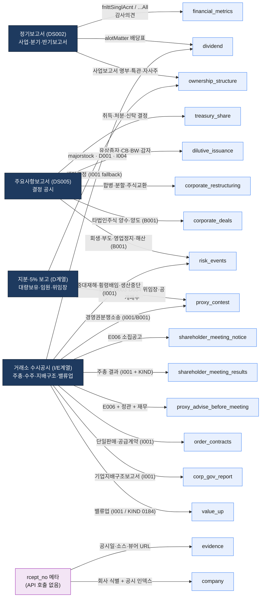
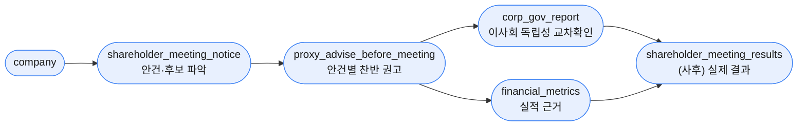
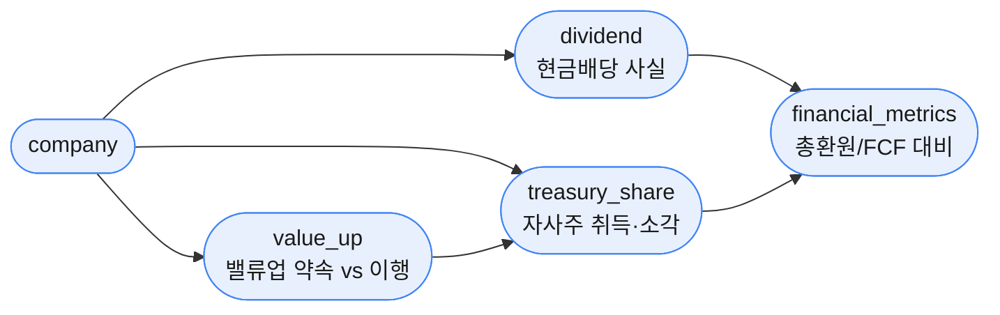
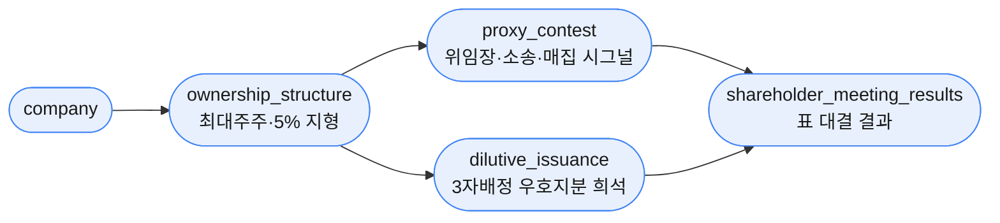
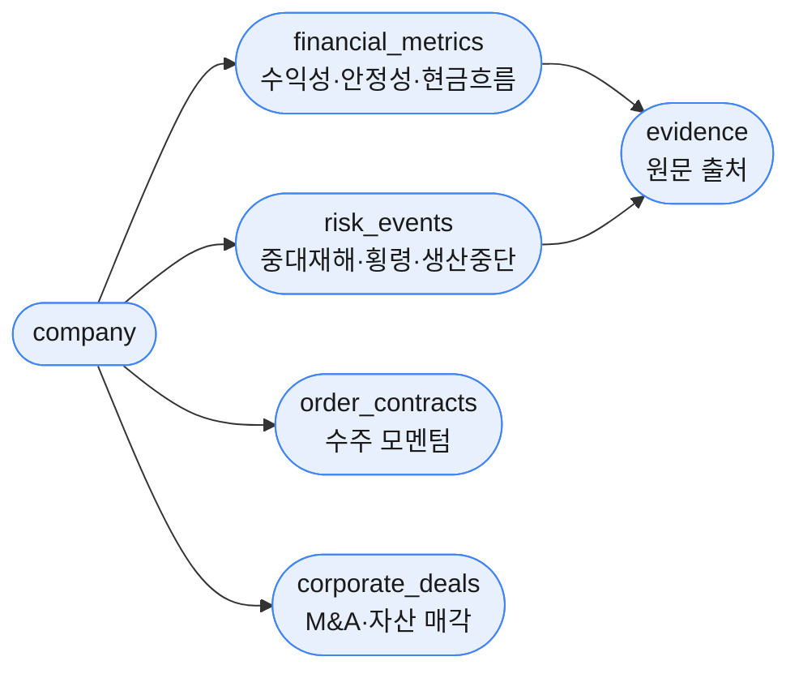

# OpenProxy MCP — 17 Tool 도식 (공시 매핑 · 기능 · 플로우)

> 소스 기준 실측 매핑 (`open_proxy_mcp/services/*.py`). 현실 질문/사용케이스 위주.
> mermaid 다이어그램 — Obsidian / GitHub / mermaid.live 에서 렌더, PNG·PDF 1페이지 export 가능.

---

## 도식 1 — Tool → 공시 매핑 (한 페이지)

DART 공시 채널(좌) → 각 채널을 읽는 tool(우). 한 tool이 여러 채널을 묶기도 함.

**채널 요약**

| 채널 | 핵심 tool | detail code |
|------|-----------|-------------|
| 정기보고서 (DS002) | financial_metrics, dividend, ownership_structure | (보조표·전용 API) |
| 주요사항보고서 (DS005) | treasury, dilutive, restructuring, corporate_deals, risk_events | B001 등 |
| 지분·5% (D계열) | ownership_structure, proxy_contest | D001/D003/D004, I004 |
| 거래소 수시공시 (I/E계열) | notice, results, proxy_advise, order_contracts, corp_gov, value_up, risk_events | E006, I001 |
| 메타 가공 | company, evidence | — (API 0회) |

---

## 도식 2 — Tool → 기능 (어떤 질문에 답하나)

사용자 의도(4대 관심사) 기준으로 묶음. 모든 흐름은 `company`로 시작, `evidence`로 출처 확인.

```mermaid
flowchart TB
    classDef entry fill:#fff3e0,color:#1a1a1a,stroke:#fb8c00,stroke-width:2px;
    classDef tool fill:#e8f0fe,color:#1a1a1a,stroke:#4285f4;
    classDef grp fill:#f1f8e9,color:#1a1a1a,stroke:#689f38;

    CMP(["company<br/>'이 회사 최근 뭐 있어?'"]):::entry

    CMP --> G1["주총 / 의결권"]:::grp
    CMP --> G2["주주환원"]:::grp
    CMP --> G3["지배구조 / 경영권"]:::grp
    CMP --> G4["펀더멘탈 / 사업"]:::grp

    G1 --> Q1a["shareholder_meeting_notice<br/>'이번 주총 안건·이사후보·보수한도?'"]:::tool
    G1 --> Q1b["proxy_advise_before_meeting<br/>'이 안건 찬성? 반대?'"]:::tool
    G1 --> Q1c["shareholder_meeting_results<br/>'안건 통과됐어? 찬성률은?'"]:::tool

    G2 --> Q2a["dividend<br/>'배당 얼마? 배당성향 추이?'"]:::tool
    G2 --> Q2b["treasury_share<br/>'자사주 사? 소각했어?'"]:::tool
    G2 --> Q2c["value_up<br/>'밸류업 계획 냈어? 지켰어?'"]:::tool

    G3 --> Q3a["ownership_structure<br/>'최대주주 누구? 5% 큰손은?'"]:::tool
    G3 --> Q3b["proxy_contest<br/>'경영권 분쟁·위임장 대결 있어?'"]:::tool
    G3 --> Q3c["corp_gov_report<br/>'이사회 독립성·지배구조 점수?'"]:::tool
    G3 --> Q3d["dilutive_issuance<br/>'증자·CB로 내 지분 희석돼?'"]:::tool
    G3 --> Q3e["corporate_restructuring<br/>'합병·분할? 합병비율은?'"]:::tool
    G3 --> Q3f["corporate_deals<br/>'뭘 인수·매각했어?'"]:::tool

    G4 --> Q4a["financial_metrics<br/>'재무 건전해? 영업이익률 추이?'"]:::tool
    G4 --> Q4b["order_contracts<br/>'수주 받았어? 매출 대비 규모?'"]:::tool
    G4 --> Q4c["risk_events<br/>'사고·횡령·생산중단 악재 있어?'"]:::tool

    Q1c -.출처.-> EVD["evidence<br/>'그 근거 공시 원문 어디?'"]:::tool
    Q3a -.출처.-> EVD
    Q4a -.출처.-> EVD
```

---

## 도식 3 — 현실 사용케이스 플로우

실제로 가장 많이 나오는 4가지 시나리오의 tool 체이닝.

### ① 주총 시즌: "이 회사 의결권 어떻게 행사하지?"

### ② 주주환원 점검: "주주한테 얼마나 돌려줬나?"

### ③ 경영권 / 지배구조 리스크: "이 회사 흔들려?"

### ④ 사업·악재 스캔: "지금 이 종목 사도 돼?"

---

## 부록 — Tool별 1줄 매핑 (전수)

| Tool | 주 공시/엔드포인트 | detail code | 답하는 질문 |
|------|-------------------|-------------|-------------|
| company | list.json | — | 회사 식별 + 최근 공시 인덱스 |
| financial_metrics | fnlttSinglAcnt / ...All, 감사의견 | — | 재무 펀더멘탈 + 회계 risk |
| dividend | alotMatter (권위) + I001 (fallback) | I001 | 실지급 배당 사실·성향·추이 |
| ownership_structure | majorstock + I004 + D001 + 사업보고서 | I004, D001 | 지분 구조 + 공동보유자 분해 |
| treasury_share | tsstk*Decsn + 결과/소각 | B001·E001·E002·I001 | 자사주 이벤트 + 사이클 매칭 |
| dilutive_issuance | piic/cvbd/bdwt/cr Decsn | — | 희석성 증권 4종 발행 결정 |
| corporate_restructuring | cmpMg/cmpDv/cmpDvmg/stkExtr Decsn | — | 합병·분할·주식교환 + 비율 |
| corporate_deals | list.json + 키워드 | B001, I001 | 지분·자산 인수/매각 |
| order_contracts | list.json + 본문 | I001 | 수주 + 매출 대비 % |
| shareholder_meeting_notice | list.json + 원문 | E006 | 주총 소집공고 (사전) |
| shareholder_meeting_results | list.json + KIND | I001 | 주총 의결 결과 (사후) |
| proxy_advise_before_meeting | E006 + 정관 + 재무 | E006, I001 | 사전 안건별 의결권 권고 |
| proxy_contest | D001/D003/D004 + I001/B001 + majorstock | D001·D003·D004·I001·B001 | 위임장·소송·5% 시그널 |
| corp_gov_report | list.json + 원문 (15지표) | I001 | 지배구조 + 지표 준수율 |
| value_up | list.json (I001) / KIND 0184 | I001 | 밸류업 계획 + 이행 |
| risk_events | I001 + B001 병렬 | I001, B001 | 중대재해·횡령·생산중단 |
| evidence | rcept_no 메타 (API 0) | — | 공시 메타 + 뷰어 링크 |
