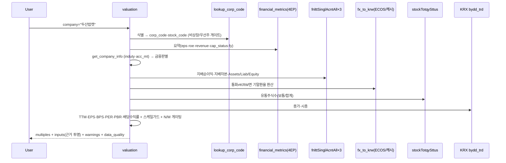

# valuation

## 한 줄 요약
DART(공시) + KRX(공식시세) 기반 **상대가치 배수** — PER(FY0·TTM) · PBR(MRQ) · 배당수익률. 지배주주
귀속 기준, 비KRW 기능통화 자동 환산(ECOS), 실시간 스케일가드 + N/M 게이팅 + 식별 status 4단.
설계·검증 근거 = [[valuation-methodology]].

## 사용법
```
valuation(company="두산밥캣")                    # firm: 기업 심층 (실시간)
valuation(scope="market")                        # 시장 전체(KOSPI·KOSDAQ) + 주간 히스토리
valuation(scope="sector", company="두산밥캣")    # 산업별 표 + 기업 vs 소속 섹터 비교
valuation(scope="firm_history", company="삼성전자")  # 종목 PER/PBR 시계열 — FY0·TTM·MRQ (주간 곡선 + 월말 요약)
```
자연어 예시:
- "삼성전자 밸류에이션" → firm: PER 46.9(FY0)/21.6(TTM) · PBR 4.33 · 배당수익률 0.54%
- "두산밥캣 PBR" → USD 재무 자동 KRW 환산(ECOS 1,434.9) → PBR 0.86
- "코스피 지금 싸?" → market: KOSPI PER 20.4(TTM)·PBR 2.23 + 주간 추이
- "반도체 업종 밸류" → sector: KSIC 섹터별 PER/PBR 표

## 입력 인자
| 인자 | 타입 | 필수 | 설명 | 기본값 |
|---|---|---|---|---|
| company | str | firm·firm_history는 필수 | 회사명 / ticker(6자리) / corp_code. sector에선 선택(소속 섹터 비교) | "" |
| scope | str | no | `firm`(심층·실시간) / `market` / `sector` / `firm_history`(주간 곡선 + 월말 요약, DB 계산) / `explain`(수치 근거 — company 지정 시 실제 값 대입 계산 과정, 미지정 시 방법론·기준·출처 전문) | "firm" |
| format | str | no | "md" / "json" | "md" |

## scope 라우팅 — 기능 → 데이터 소스 (DB-first)

| scope | 소스 | 갱신 | 내용 |
|---|---|---|---|
| `firm` | 실시간 DART 재무 × `krx_weekly` 시세 | 매 호출(재무) + 일별(시세) | EPS·BPS·배당·경고·FX·스케일가드 — 정밀 심층 |
| `market` | `mkt_val_history` | 주간 스냅샷(cron) | KOSPI·KOSDAQ 시총가중 PER/PBR + 히스토리 |
| `sector` | `mkt_sector_val` (+`mkt_valuation` 비교) | 주간 스냅샷(cron) | KSIC 하이브리드 섹터별 + 기업 vs 섹터 |
| `firm_history` | `krx_weekly`(주간 시총) × `mkt_fund_hist`(연간 FY0) × `mkt_fund_q`(분기 TTM/MRQ) + `mkt_valuation`(주간 스냅샷, +krx_stock_flags 경고) | compute-on-query(저장 X) + cron 축적 | 종목 PER/PBR 시계열 — **FY0·TTM·MRQ 세 기준**. 차트=전구간 주간 곡선(`data.series`), 텍스트=최근 12개월 월말(`data.summary`, ▲분기공시 마커) + 연말 밴드(장기). TTM=최근4분기 지배순이익(2020~), MRQ=최근분기 지배자본. 시총 기반이라 수정주가 조정 불변 |
| `explain` | firm 재계산(company 시) / 정적 텍스트 | — | **수치 근거** — "이 PER 어떻게 나온 거야?"에 계산 과정(실제 값 대입)·기준·출처·주기로 답변 |

- 스냅샷 3테이블은 `scripts/market_val_weekly.py`가 갱신(cron `.github/workflows/market-val-weekly.yml`,
  매일 KST 10:17 — 매일 수집(KRX 금요일 지연 게시 커버)→같은 ISO주 수렴→주 마지막 거래일 영구 보존, KRX 4콜/일).
- **market/sector 히스토리는 2020-01~현재**: cron이 쌓는 최신분 + `market_val_history_backfill.py`
  (1회성, DART 0콜)가 채운 과거 76개 월말(FY0 기준) — 합쳐서 "2020년부터 코스피 PER 추이" 응답 가능
  (260705). TTM/MRQ 과거밴드는 분기 데이터 완비 후 별도 추가 예정, 현재는 FY0만.
- **⚠ 방법론 이중성**: firm = 보통주 주가÷EPS(유통주식). 스냅샷 = **총시총(우선주 귀속)÷지배순이익**
  (시총가중, 지수 표준) — 삼성 PER(TTM) 20.0(firm) vs 21.9(스냅샷)처럼 다를 수 있음. 출력에 명시.
- **수정주가**: PER/PBR/시총 시계열은 시총 기반이라 분할·무상증자 **조정 불변**(주가×주식수 상쇄) —
  조정 불필요. 주당 가격·EPS 시계열을 노출하게 되면 krx_adj_factor_v3(기준가 리셋 실측) 적용 필수.
- 비KRW 22사(USD/CNY/JPY): 스냅샷 배치가 fx_rate(기말환율)로 KRW 환산 후 산출(구 aggregate의
  원통화 혼합 합산 버그 수정, 260705).

## 데이터 계보 (소스 → 아이템 → 연산) — 핵심

| 단계 | 소스 (호출) | 뽑는 아이템 | 쓰임 |
|---|---|---|---|
| 식별 | **`resolve_company_query`(공용 리졸버 — company 툴과 동일 진입, 260705 채택)** → DART corp master | corp_code · stock_code · 상장여부 · ambiguous 후보 | 진입 게이트(동명 다수=후보표 / 비상장·우선주·빈입력 차단) |
| 재무요약 | `build_financial_metrics_payload(stock_code)` → DART **fnlttSinglAcnt·AcntAll·Indx·감사의견** | eps_krw · revenue_krw · roe_pct · capital_impairment_status · fiscal year | EPS(FY0)·ROE·매출·자본잠식 상태 |
| 업종/결산월 | `get_company_info` → DART **company.json** | induty_code(KSIC) · acc_mt(결산월) | 금융 판별(64/65/66) · FX 기준일 |
| 재무원장 | `get_fnltt_singl_acnt_all` ×3 (연간 11011 + 1Q당해 11013 + 1Q전년 11013) | `_ctrl_ni`(지배순이익) · `_ctrl_equity`(지배자본) · `_gid`(Assets/Liab/Equity, **exact-match**) | TTM 순이익 · BPS · 스케일 항등식 |
| 통화 | `statement_currency`(currency 필드) + `fx_to_krw` → **ECOS 731Y001**(→야후 폴백) + Supabase `fx_rate` 캐시 | 기능통화 · 기말환율 | 비KRW → 재무 KRW 환산 |
| 주식수 | `get_stock_total` → DART **stockTotqySttus** | distb_stock_co(합계/보통주, 자기주식 제외) | EPS 분모(보통주)·BPS 분모(합계) |
| 시세 | **Supabase `krx_weekly`(검증 자산, 2015-12~)** 우선 → 미스·최신 확보 시만 라이브 KRX stk/ksq_bydd_trd | close(종가) · mktcap · list_shrs | 배수 분자(주가)·시총 노출·주식수 검증 |
| 배당 | `_annual_summary` → DART **alotMatter** | cash_dps(주당현금배당, 이미 주당값) | 배당수익률 |

## 연산 파이프라인
```
TTM 순이익   = ni_fy(연간) + ni_qc(1Q당해) − ni_qp(1Q전년)      # 지배순이익 기준
EPS(FY0)     = 공시 기본주당이익 (연간 재무제표 직접, 3단 매칭)   # 결측 시 지배순이익÷보통주 폴백
EPS(TTM)     = 공시 EPS 조립: FY0 + 분기누적(thstrm_add) − 전년동기누적  # FY0과 같은 공시 기준(대칭)
BPS          = 지배자본(MRQ 우선, 없으면 FY0) ÷ shares_total(합계)
PER(FY0/TTM) = 주가 ÷ EPS(FY0/TTM)
PBR(MRQ)     = 주가 ÷ BPS
배당수익률    = DPS ÷ 주가 × 100
```
- **지배주주 귀속 일관**: EPS·BPS·PER·PBR 모두 지배지분(`_ctrl_*`). 지주사(NCI 큰) 과대 방지.
  단 **스케일 항등식은 총자본**(지배+비지배, `_gid` Equity) — 지배자본만 쓰면 NCI만큼 상시 오탐.
- **EPS 대칭화(260705)**: FY0·TTM 모두 공시 기본주당이익 기준(TTM=공시 EPS 조립) — 두 PER 직접
  비교 가능. 커버리지 99%(100사 스윕), 결측 시 지배NI÷보통주 폴백+경고. 기중 주식수 급변 시
  조립 한계는 sanity 경고. 상세 [[per-pbr-data-points]]·[[valuation-methodology]].

## 가드 4종
1. **식별 status**(진입부): `invalid`(빈입력) · `not_found`(미존재·우선주 — 마스터는 보통주 코드만) ·
   `unlisted`(비상장, 주가 없어 배수 불가 + 상장 후보 안내) · `no_financials`(재무 미확정). 크래시·오매핑 0.
2. **N/M 게이팅**: 분모(EPS·BPS)≤0 또는 **완전자본잠식**(cap_status=full)이면 해당 배수 = None(N/M).
   적자를 숫자 배수로 내보내지 않음.
3. **스케일가드**([[valuation-methodology]] §9, `services/scale_guard.py`): hard=②항등식(자산=부채+자본)·
   ③시장최댓값배수 / soft=①배수점프·④시총비율. **개별조회는 마스킹 안 함 — 값 유지 + 강한 경고**.
   (시장 aggregate는 반대로 무효화 — 소비 맥락이 다르므로.)
4. **통화**: 비KRW면 회계기말 환율로 순이익·자본·자산·부채 환산 후 배수 산출 + 환산 경고.

## 출력 schema (data dict)
```json
{
  "company_id": "cmp_241560",
  "identifiers": {"ticker": "241560", "corp_code": "01032486"},
  "sector_class": "general",           // general | financial
  "fiscal_year": 2025,
  "price_krw": 64400, "price_date": "20260703",
  "multiples": {
    "per_fy0": 15.19, "per_ttm": 14.58,
    "pbr_mrq": 0.86, "pbr_basis": "MRQ",
    "dividend_yield_pct": 2.64
  },
  "inputs": {
    "eps_fy0_krw": 4241, "eps_ttm_krw": 4416, "bps_krw": 74931, "roe_pct": 5.83,
    "net_income_fy0_krw": 405931775100, "net_income_ttm_krw": 422682797700,
    "controlling_equity_krw": 7171963096800,
    "shares_common": 95713802, "shares_total": 95713802,
    "dps_krw": 1700, "revenue_fy0_krw": 8870273429400,
    "common_market_cap_krw": 6173130586000,
    "capital_impairment_status": "normal",
    "functional_currency": "USD", "fx_rate_to_krw": 1434.9
  },
  "warnings": ["기능통화 USD — 재무를 …환율 1,434.9원/USD로 KRW 환산…", "주가 기준일 …"],
  "data_quality": {"scale_tier": "clean", "scale_flags": [], "values_masked": false},
  "note": "lean v1 — RIM·EV/EBITDA·PSR·FCF·5년밴드·PIT는 v1.1. EPS(FY0)=공시 기본주당이익…"
}
```
- **단위**: 모든 `_krw` 필드 = 원 raw int. `_pct` = float(2.64 = 2.64%). 비KRW사는 환산 후 KRW.
- status 필드: `ok` / `invalid` / `not_found` / **`ambiguous`(동명 후보표)** / `unlisted` / `no_financials` / `no_data`(배치 미실행) / `db_error`(DB 일시 장애).

## DART/KRX 콜 budget (per-firm)
| 소스 | 콜 | 비고 |
|---|---|---|
| DART financial_metrics(summary) | ~7 | 4 endpoint + TTM/폴백 |
| DART company.json | 1 | 업종·결산월 |
| DART fnlttSinglAcntAll ×3 | 3 (~6) | 연간+1Q당해+1Q전년, CFS→OFS 폴백 시 최대 2배 |
| DART stockTotqySttus | 1 | 유통주식수 |
| DART alotMatter(배당) | ~2 | 연간 요약 |
| **DART 합계** | **11 (최대 ~15, 실측 260705)** | per-firm. scope=market/sector/firm_history는 **DART·KRX 0콜(DB만)** |
| KRX (시세) | **serve-time 0** | Supabase `krx_weekly`에서 읽음. 라이브 KRX는 하루 1회 최신 거래일 스냅샷 확보 시만(전종목 2콜, 코스피·코스닥 병렬) → **유저 수 무관 하루 ~수십콜 bounded**. KRX 개인키 일 10,000 한도 보호 |
| ECOS 환율 | 0~1 | 비KRW사만, 분기말 캐시 히트 시 0 |

**KRX 시세 = Supabase krx_weekly 서빙(260705)**: KRX Open API는 개인키 1개·일 10,000콜 한도(배치와
공유)라 233명 유저를 라이브로 서빙하면 키 소진 시 배수 N/M 위험. FX 캐시와 동형 — 매일 최신 거래일
전종목 스냅샷을 라이브로 확보해 **'그 주(ISO week)' 슬롯에 덮어쓰며 갱신**(전날 종가까지 표시), 주중
일별은 다음 거래일에 덮여 사라지고 **주 마지막 거래일만 영구 보존**(주당 1스냅샷 ~52/년 = 무료티어
보호). valuation은 DB 우선 읽기, 서빙 KRX 콜 = 하루 ~2. 축적 주간가격은 v1.1 5년밴드·PIT 재사용.
price_date로 기준일 투명.

**fetch 병렬화(260705)**: 최상위 await를 의존성 3단계 gather로 — P1(financial_metrics·company·KRX,
fy 무관) → P2(연간원장·주식수·배당, fy 의존) → P3(1Q당해·전년, fs_used 의존). info·market이 무거운
financial_metrics 뒤에서 대기하던 것 제거. 실측 개별 조회 ~6.3s→~2.2s, 8종목 배치 50s→20s(회귀 클린).

→ [[tool_call_budget]]에 실측 반영 완료(260705).

## Flow


## 검증 (260705, 등록 전)
7-에이전트 다각 검증(대형제조·금융·통화환산·지주NCI·부실스케일·엣지식별·독립산식감사) + 웹검증.
**견고성 blocker 0** — 18개 배수 독립 재계산 전부 일치, 두 자본 구분 SK(NCI 71%) 정확, 통화 ECOS
정합, 완전자본잠식(이오플로우) N/M 정확, 크래시·오매핑 0. 상세 = [[valuation-methodology]] §"등록 전
7-에이전트 검증".

## 알려진 issue + v1.1
- **EPS FY0/TTM 방법론 비대칭**(문서화 완료, 통일은 v1.1).
- **shares_bad**(유통주식수 파싱오류) 시 PBR·EPS_ttm은 무효화되나 eps_fy0(공시값)는 유지 — 흑자
  종목이면 EPS 과소·PER 과대 누수 가능(v1.1: eps_fy0도 차단).
- **unlisted 상장후보 안내**가 리졸버 exact-match 단락으로 비는 경우(예 "삼성") — 부분매치 별도조회(v1.1).
- 리츠 전용 섹터 처리 없음 / 데이터부재(상폐) 종목이 금융으로 오분류(경미).
- v1.1 백로그: RIM·EV/EBITDA·PSR·FCF·peer 랭킹·자기 5년 밴드·PIT 시계열 · FX 평균환율(flow) ·
  한국은행 ECOS를 야후 폴백 대신 정본 유지 · 우선주 총시총 합산.

## 관련
- [[valuation-methodology]] — 설계·스케일가드·FX·검증 전체 근거(decisions/)
- [[financial_metrics]] — 재무 펀더멘탈(이 tool이 요약을 재사용). valuation=시장배수, financial_metrics=펀더멘탈
- [[배당수익률]] — DPS ÷ 주가
- [[environment-secrets]] — ECOS_API_KEY·KRX_OPEN_API_KEY 등 필요 키
